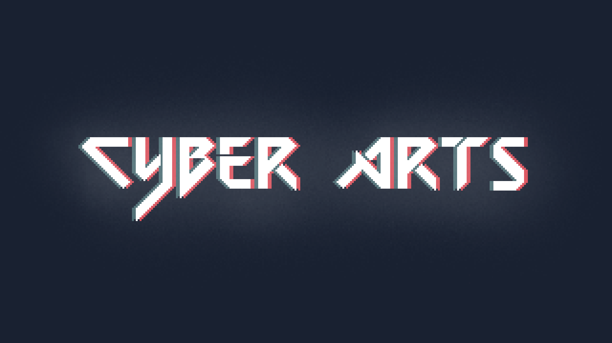

# Readme

This file contains relevant information about installation and startup.

## Installation
[Linux / Windows / Mac OS / Other OS]

1. Install Elm from the Elm official website : https://guide.elm-lang.org/install/elm.html .
2. Open the terminal, clone this repository and `cd` into the directory of this repository.
3. Using `GNU Make` Run `make` to set dependencies ready.
4. Run `elm reactor` to start the server. Open your browser, go to `localhost:8000` and click to `index.html`.
5. Enjoy your game!

## Usage

Follow the Rule page and instuction in the Home page!

# Contributing

Due to the rules and regulation of the SilverFocs incubator, pushing code to this project by people other than assigned members of the group is prohibited. 

Other ways of contribution, such as reviews and bug reports are welcome.

# Author team 
	CyberArts    

    

Wang Yiyang, 
Jiao Tianqin, 
Chu Jiale, 
GOR TADEVOSYAN 

# License 
[SilverFocs Incubator Licence](https://focs.ji.sjtu.edu.cn/silverfocs/markdown/license) 
